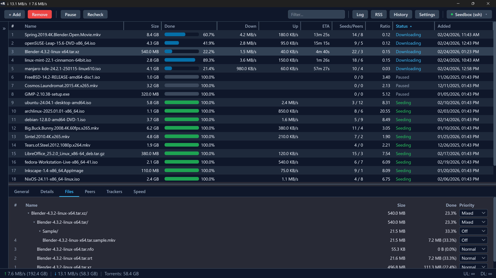
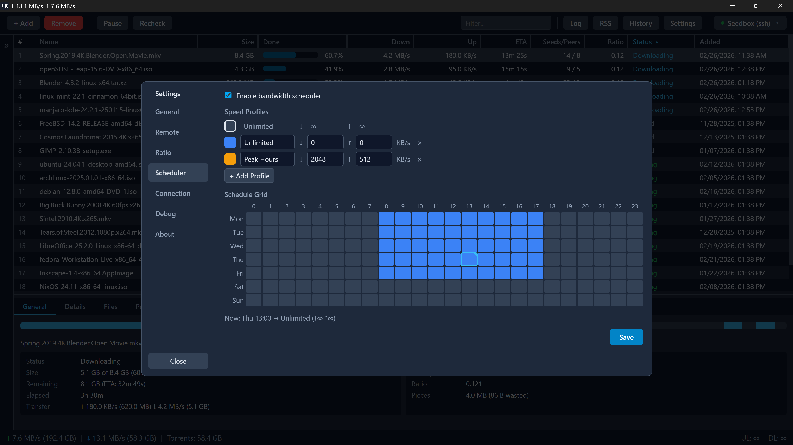
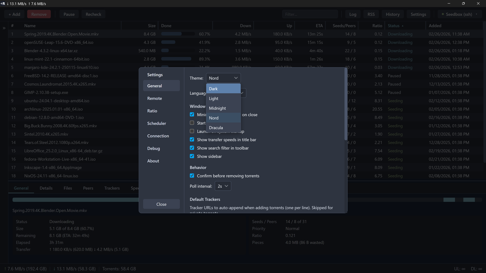

# Ctrl+R

A modern desktop thin client for [rTorrent](https://github.com/rakshasa/rtorrent). Connects to your rTorrent instance over SSH, TCP/SCGI, or HTTP and provides a full-featured GUI for managing torrents.

If you find Ctrl+R useful, [buy me a coffee](https://ko-fi.com/mikesilvo) ☕


## Download

**[Latest Release](https://github.com/MikeSiLVO/ctrlr-releases/releases/latest)**

| Platform | Installer |
|----------|-----------|
| Windows (x64) | `.exe` (NSIS) |
| macOS (Apple Silicon / Intel via Rosetta) | `.dmg` |
| Linux (x64) | `.deb` / `.AppImage` |

## Installation

### Windows

Run the `.exe` installer. Windows may show a SmartScreen warning since the app is unsigned — click **More info** then **Run anyway**.

### macOS

Open the `.dmg` and drag Ctrl+R to Applications. On first launch, right-click the app and select **Open** to bypass Gatekeeper (required for unsigned apps).

### Linux

**Debian/Ubuntu:**

```sh
sudo dpkg -i ctrl-r_*.deb
```

**AppImage:**

```sh
chmod +x ctrl-r_*.AppImage
./ctrl-r_*.AppImage
```

## System Requirements

- Windows 10+ (x64)
- macOS 10.15+ (Intel or Apple Silicon)
- Linux with WebKitGTK 4.1 (x64)
- A running rTorrent instance to connect to

## Getting Started

On first launch, Ctrl+R opens the Settings dialog to configure your connection. Create a profile with one of the supported connection types:

| Type | Use Case |
|------|----------|
| **SSH Tunnel** | Most common. Ctrl+R manages the tunnel automatically. |
| **TCP/SCGI** | Direct connection over LAN or a pre-established tunnel. |
| **HTTP** | Via an nginx `scgi_pass` proxy with optional Basic auth. |
| **XMLRPC** | XML-RPC endpoint (e.g., ruTorrent's RPC). |
| **Unix Socket** | rTorrent running on the same machine. |

Passwords are stored in your OS credential store (Windows Credential Manager, macOS Keychain, or Linux Secret Service) — never in config files.

> **Note:** When connecting over the internet with HTTP or XMLRPC, use HTTPS to avoid sending credentials in plain text. SSH tunnel connections are encrypted by default.


### Configuration

All connection settings are managed through the Settings dialog.

## Features

### Torrent Management

- Add torrents by magnet link, URL, `.torrent` file, or drag-and-drop
- Multi-add dialog with per-torrent options, directory picker, and file selection
- Pause, resume, remove, recheck, reannounce
- Set priority (torrent-level and per-file)
- Move torrent data to a different directory
- Tag/label management
- Named throttle groups and ratio groups with auto-actions
- Default tracker list (auto-appended to new public torrents)


### Interface

- Sortable, resizable, reorderable columns with show/hide toggle
- Detail panel with 6 tabs: General, Details, Files (folder tree), Peers, Trackers, Speed Graph
- Sidebar filtering by status, label, and throttle group
- Text search filter
- Inline speed limit editing in the status bar
- Disk space monitoring with seedbox provider support (Whatbox)
- Transfer speeds in the title bar



### RSS Feeds

Automated downloading with regex rules, smart episode tracking (S01E02 parsing), quality preferences, and per-rule directory/label/throttle assignment. Configure feeds and rules from the RSS dialog or directly in `~/.ctrlr/rss.toml`.


### Bandwidth Scheduler

7-day × 24-hour grid with named speed profiles. Paint hours on the grid to assign speed limits that are applied automatically. Configure in Settings or `~/.ctrlr/scheduler.toml`.



### Torrent History

Every torrent that passes through Ctrl+R is logged to a local SQLite database with its `.torrent` file archived. Browse, search, and re-add or export torrents from the History dialog.

### Profiles

Multiple connection profiles with quick-switch from the toolbar. Each profile stores its own connection settings independently.

### Themes

5 built-in themes: **Dark**, **Light**, **Midnight**, **Nord**, **Dracula**.



### Languages

English, Deutsch, Español, Français, Português (BR), Русский, 简体中文. Detected automatically from your OS locale.

### Desktop Integration

- System tray with start minimized and close-to-tray options
- Autostart on system boot
- `ctrlr://` deep links for magnet URIs
- `.torrent` file association
- Desktop notifications

## Keyboard Shortcuts

| Shortcut | Action |
|----------|--------|
| `Ctrl+N` | Add torrent |
| `Ctrl+A` | Select all |
| `Ctrl+F` | Search filter |
| `Delete` | Remove selected |
| `P` | Pause / Resume |
| `↑` / `↓` | Navigate torrent list |
| `Escape` | Clear search |

On macOS, use `Cmd` instead of `Ctrl`.

## License

Copyright (c) 2025 MikeSiLVO. All rights reserved.
